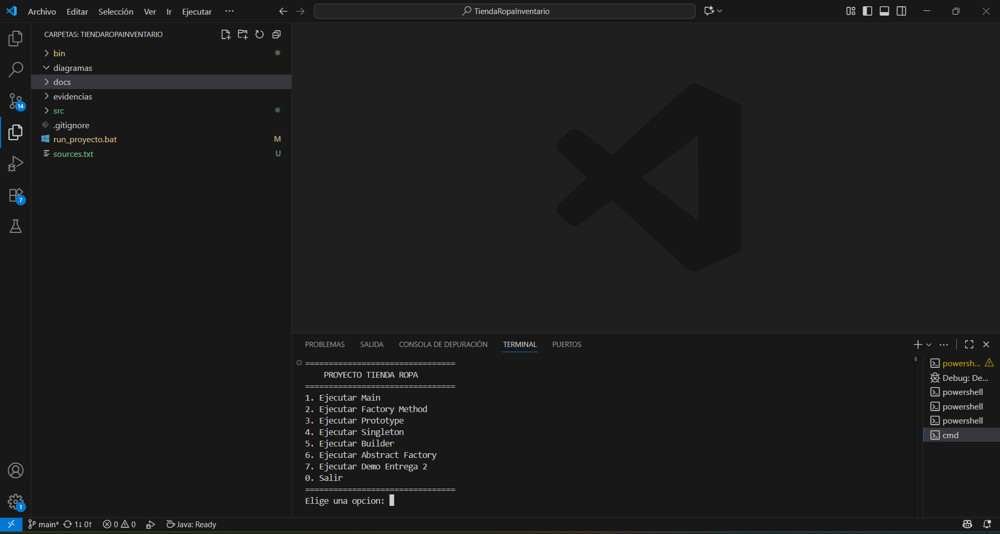
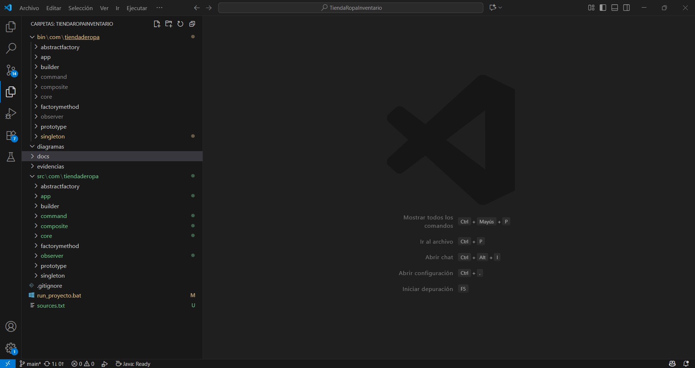

# Proyecto Tienda de Ropa - Entrega 2  

## Descripción  
Simulación de inventario para una tienda de ropa aplicando **patrones de diseño**:  
- Factory Method  
- Prototype  
- Singleton  
- Builder  
- Abstract Factory  
- Command  
- Composite  
- Observer  

El sistema permite gestionar productos, ajustar stock, clonar ítems, validar reposiciones y generar alertas de bajo inventario.  

---

## Diagramas
### Diagrama de Clases
Representa la estructura del sistema de inventario con los patrones Composite, Observer, Command y Prototype.

### Diagrama de Secuencia – Clonado
Muestra la secuencia de pasos al aplicar el patrón Prototype para clonar productos en el inventario.

### Diagrama de Secuencia – Ajuste de Stock
Evidencia del flujo cuando se aplica el patrón Command para ajustar cantidades en el inventario.

---

## Evidencias

### Ejecución del sistema — Demo 2
[](evidencias/evidencias-ejecucion_demo2.png)

### Estructura del proyecto en VS Code
[](evidencias/evidencias-estructura_proyecto.png)


## Autores
Jhon Sebastián Zárate Hernández
Felipe Alejandro Guillen Aguilera

## Conclusiones
El proyecto permitió aplicar varios patrones de diseño en un mismo contexto (tienda de ropa).
Se integraron Composite + Observer + Command + Prototype en la demo final.
El script .bat asegura que el código compile y ejecute sin errores.
Se evidenció el trabajo en equipo mediante GitHub, garantizando trazabilidad.

## Cómo ejecutar

```bat
.\run_proyecto.bat

---

## Menú disponible
Main
Factory Method
Prototype
Singleton
Builder
Abstract Factory
Demo Entrega 2

---

## Estructura del proyecto

TiendaRopaInventario/
├─ src/com/tiendaderopa/      
├─ bin/                       
├─ diagramas/                 
│  ├─ uml_clases.png
│  ├─ seq_ajuste_stock.png
│  └─ seq_clonado.png
├─ evidencias/                
│  ├─ ejecucion_demo2.png
│  └─ estructura_proyecto.png
├─ docs/                      
│  └─ Entrega2.pdf
├─ run_proyecto.bat           
├─ sources.txt                
└─ .gitignore

